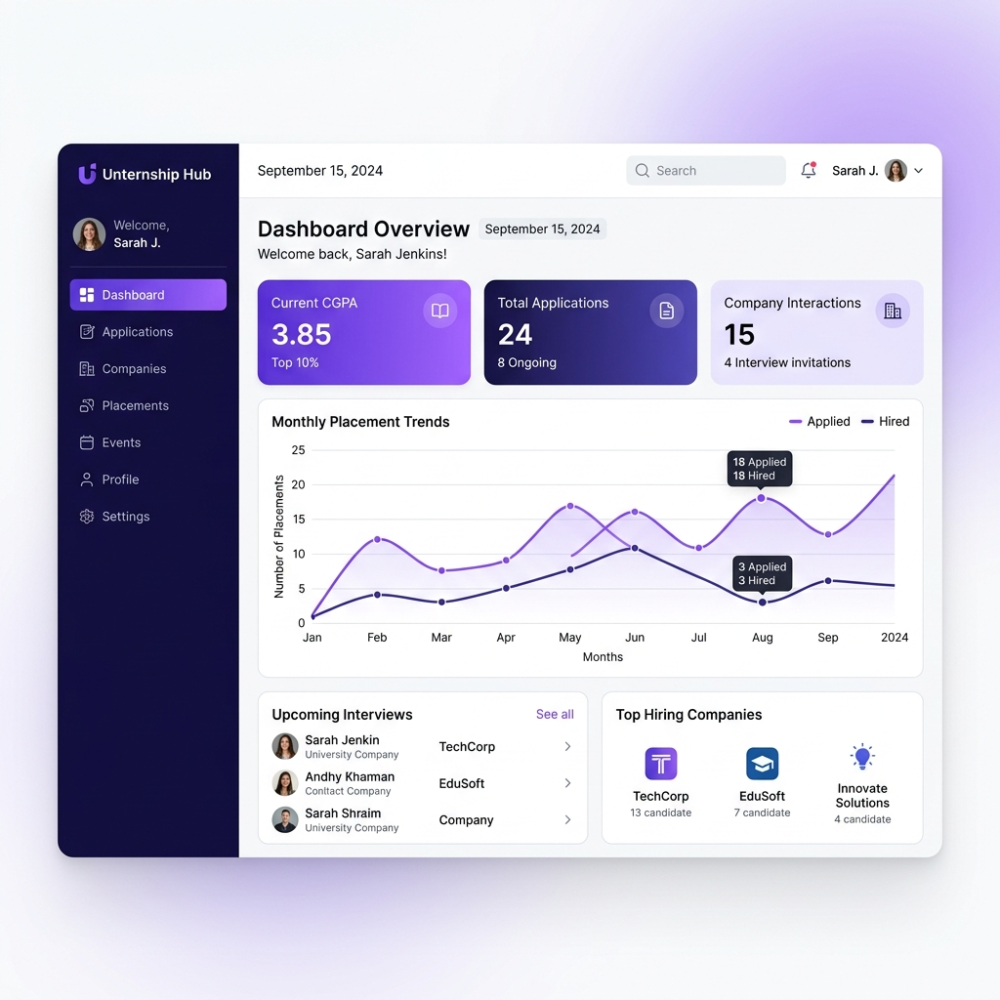

# Internship Tracker 🎓💼

An enterprise-grade University Internship Lifecycle Tracker and Corporate Portal built to manage internships from initial application submission to final NOC endorsement, weekly journal logging, and report evaluation.

🔗 **Live Deployment**: [https://praveenkumarkait24-tech-matrix.netlify.app](https://praveenkumarkait24-tech-matrix.netlify.app)

---

## 📸 Project Preview



---

## 🌟 Key Features

### 1. Role-Based Access Control (RBAC)
- **Student**: Appliess for internships, submits required files (Resume and Offer Letter), logs daily/weekly journal logs, views real-time application status, and previews/downloads the issued NOC.
- **Academic Mentor**: Reviews assigned student applications, signs off weekly journal reports, and provides feedback/scores.
- **HOD (Head of Department)**: Approves department applications and provides academic clearance.
- **Placement Cell Officer**: Performs final background corporate check, issues the digitally authenticated **No Objection Certificate (NOC)**, and manages company partners.
- **Overall System Admin**: Direct management of registered portal users, departments, and real-time security threat audit logs.

### 2. Document Submission & Verification Rules
- **No Duplicate Uploads**: Automatic in-place replacement filter for files (e.g., uploading a newer Resume overrides the existing one to keep a clean vault).
- **Mandatory Stepper Inputs**: Students cannot submit an internship application without providing both their **Offer Letter** and **Resume**.
- **Role-Gated Uploads**: Standard document additions are locked exclusively to Students. HODs, Mentors, and Placement cells possess view & download privileges for evaluation.
- **AI Document Verification**: Built-in integration with Google Gemini AI (`gemini-2.5-flash`) for automated OCR scanning of offer letters, legitimacy scoring, and verification flag recommendations.

### 3. Digital NOC PDF Export
- Dynamic layout printing for issued No Objection Certificates.
- Seamless **window.print()** popup alignment for saving certificates as clean, standardized PDFs.
- Strictly hidden from students until authorized and marked as `isNocIssued` by the Placement Cell.

### 4. Dynamic Notifications
- State-driven navbar notifications with real-time unread badges.
- Auto-decrementing count handles read confirmations dynamically on click.

---

## 🛠️ Technology Stack

- **Frontend**: React 18, Vite, Tailwind CSS, Lucide icons, Recharts (analytics & placement trends)
- **Backend**: Node.js, Express, TypeScript, Google GenAI SDK (Gemini API)
- **Database & Storage**: Supabase (Postgres Database, Row-Level Security Policies, Storage Buckets)

---

## 📂 Database Schema Design

Structured relational model optimized for university academic policies:

### 1. Profiles (`profiles`)
Stores registered university student and staff accounts.
- `id` (text, primary key)
- `name` (text)
- `role` (student, mentor, hod, placement, admin)
- `department` (text)
- `email` (text, unique)

### 2. Applications (`applications`)
Maintains details regarding student corporate internships.
- `id` (text, primary key)
- `student_id` (text, references profiles)
- `company_name` (text)
- `role_title` (text)
- `stipend_amount` (integer)
- `stage` (mentor_review, hod_review, placement_review, approved, rejected)

### 3. Student Documents (`student_documents`)
New relational tracker database table pointing to files uploaded in Supabase Storage.
- `id` (uuid, primary key)
- `application_id` (text, references applications)
- `student_id` (text, references profiles)
- `document_type` (Resume, Offer Letter, NOC, Report)
- `file_url` (text)

---

## 🚀 Supabase Storage Setup

Four custom storage buckets are used to store PDF attachments and pictures. Execute the script in **[supabase_storage.sql](file:///c:/Users/praveenkumar/OneDrive/Desktop/Internship%20Tracker%202/database/supabase_storage.sql)** in your Supabase SQL Editor:

```sql
insert into storage.buckets (id, name, public)
values 
  ('resumes', 'resumes', true),
  ('offerletters', 'offerletters', true),
  ('nocs', 'nocs', true),
  ('reports', 'reports', true)
on conflict (id) do nothing;
```

---

## ⚙️ Local Development Setup

### 1. Configure Environment Variables
Create a `.env` file inside both `/frontend` and `/backend` folders:

**Frontend Environment (`frontend/.env`):**
```env
VITE_API_URL=http://localhost:3000
```

**Backend Environment (`backend/.env`):**
```env
PORT=3000
SUPABASE_URL=https://your-project.supabase.co
SUPABASE_SERVICE_ROLE_KEY=your-service-role-key
GEMINI_API_KEY=your-gemini-key
```

### 2. Install and Run the Backend
```bash
cd backend
npm install
npm run dev
```

### 3. Install and Run the Frontend
```bash
cd frontend
npm install
npm run dev
```

---

## 📈 Git Repository
The workspace is linked and pushed directly to the remote repository:
👉 [https://github.com/praveenkumarkait24/Tech-Matrix](https://github.com/praveenkumarkait24/Tech-Matrix)
